# Sistem Berita Acara Pemeriksaan (BAP) Online - Capstone Project

Sistem berbasis web yang dirancang untuk mempermudah pengelolaan Berita Acara Pemeriksaan (BAP) antara pihak administrasi (LAA) dan Pengawas. Proyek ini dibangun menggunakan Laravel 11 dan Tailwind CSS.

## Fitur Utama

### 1. Panel Administrasi (LAA)
- **Dashboard Statistik**: Memantau jumlah BAP yang masuk, diverifikasi, dan ditunda.
- **Manajemen Pengawas**: Pengelolaan data akun pengawas ujian.
- **Verifikasi BAP**: Meninjau dan menyetujui atau menolak inputan BAP dari pengawas.
- **Rekapitulasi & Export**: Menghasilkan laporan rekap BAP dalam format PDF maupun Excel.

### 2. Panel Pengawas
- **Input BAP**: Pengisian berita acara secara digital, termasuk denah tempat duduk dan daftar ketidakhadiran peserta.
- **Riwayat & Preview**: Melihat kembali BAP yang telah diinputkan sebelum atau setelah dikirim.
- **Notifikasi**: Mendapatkan pembaruan status BAP (Diterima/Ditolak).
- **Profil & Pengaturan**: Manajemen akun pribadi.

## Teknologi
- **Framework**: Laravel 11
- **Frontend**: Blade Template, Tailwind CSS, Vite
- **Database**: MySQL/MariaDB

---

## Tampilan Aplikasi

### Dashboard & Manajemen Admin (LAA)
| | |
|---|---|
| 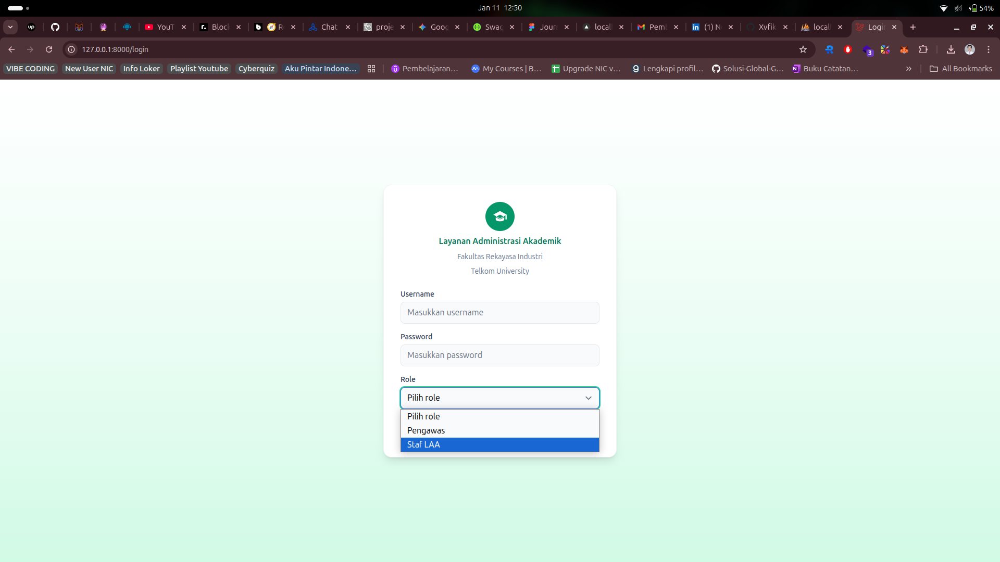 |  |
| 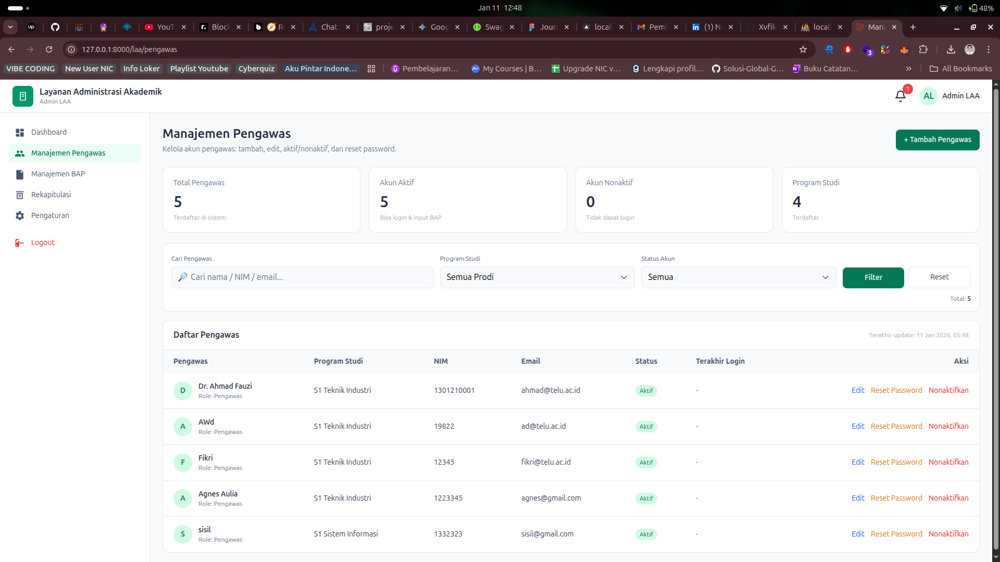 | 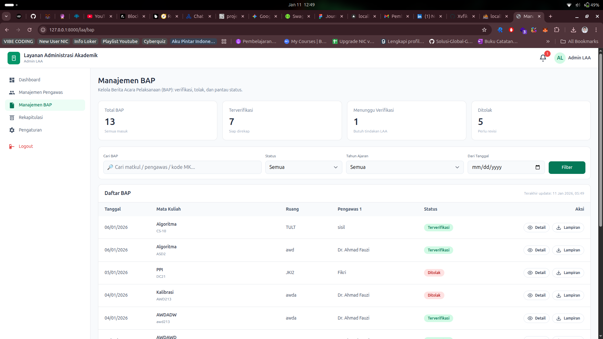 |
| 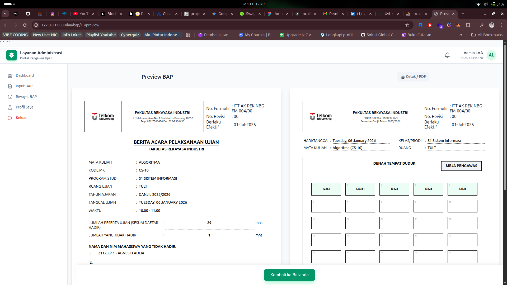 | 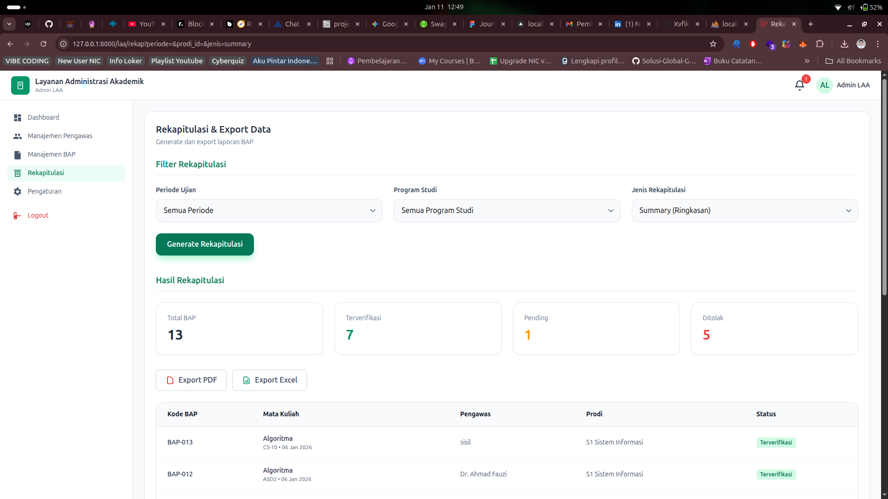 |

### Dashboard & Fitur Pengawas
| | |
|---|---|
| 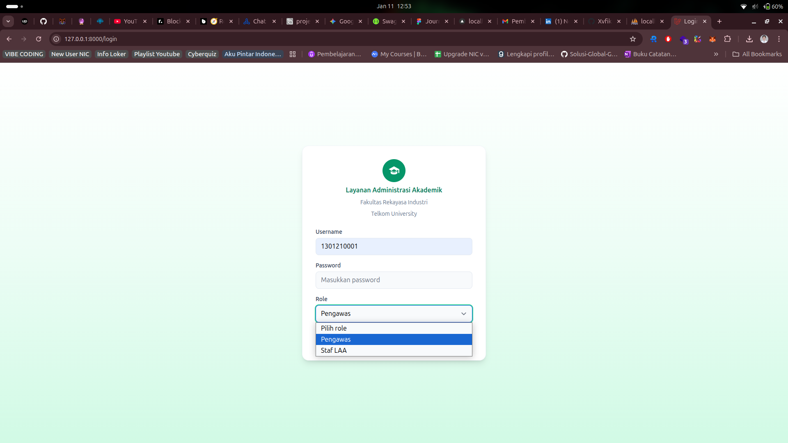 | 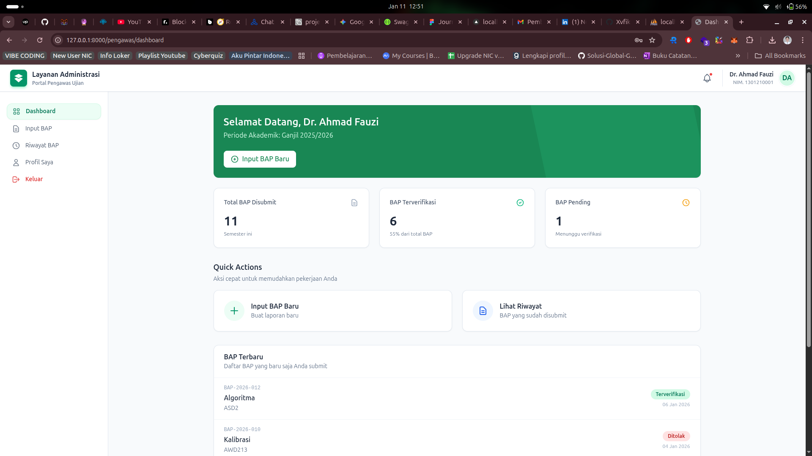 |
| 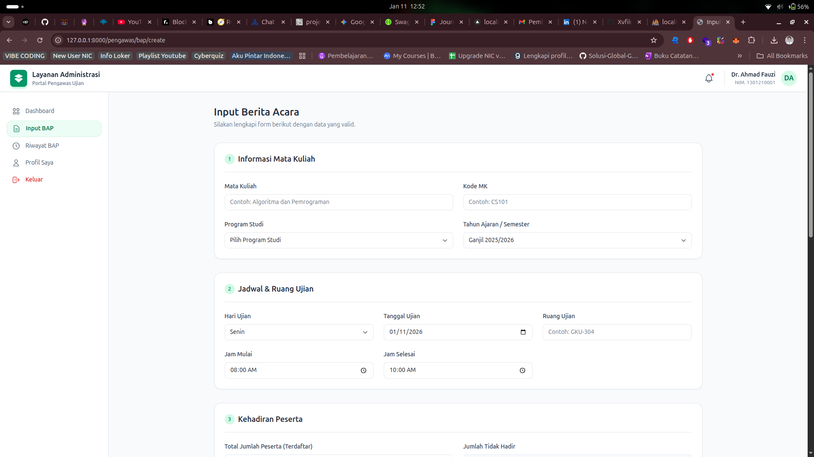 | 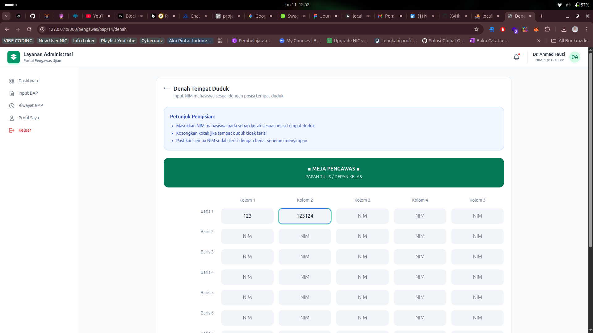 |
| 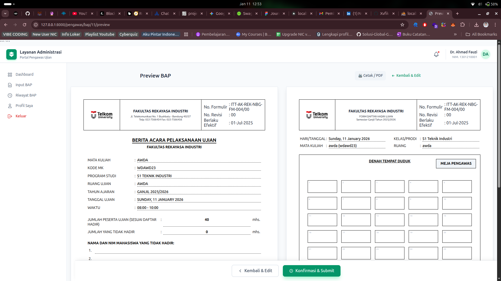 | 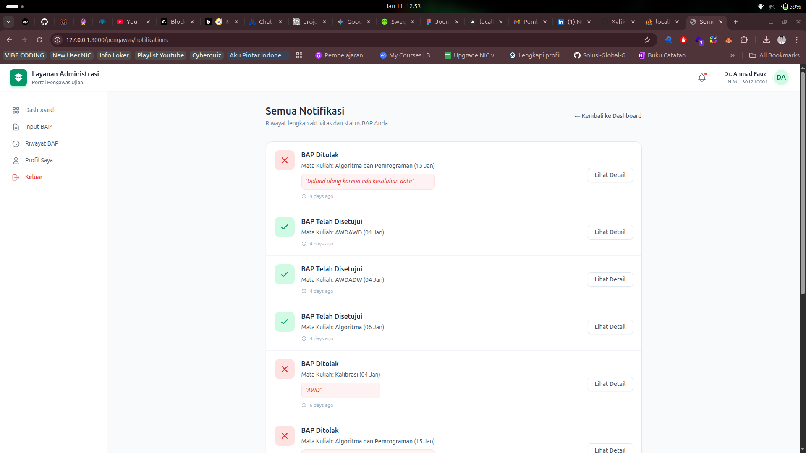 |

---

## Cara Instalasi
1. Clone repository
2. Jalankan `composer install`
3. Jalankan `npm install && npm run dev`
4. Copy `.env.example` ke `.env` dan sesuaikan database
5. Jalankan `php artisan key:generate`
6. Jalankan `php artisan migrate --seed`
7. Jalankan `php artisan serve`
